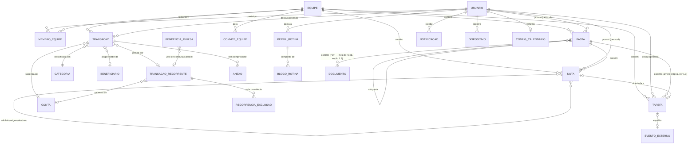
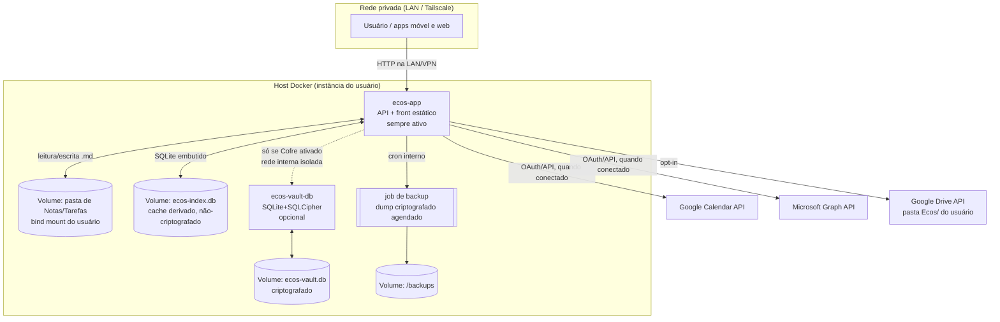

# Ecos — Arquitetura Técnica Definitiva
### Infraestrutura, Modelo de Dados, Segurança, Sincronização, Resiliência e Políticas

**Status:** documento definitivo e autossuficiente de arquitetura/backend — consolida os fundamentos originais de produto (`ecos-handoff-backend.md`) com todas as decisões técnicas fechadas desde então. Não repete nada do handoff de front-end/marca (identidade visual, navegação de tela, tom de voz) — isso continua vivendo só em `ecos-handoff-frontend-marca.md`.
**Escopo:** backend + infraestrutura + fundamentos de produto que orientam essa arquitetura. Nada de design de interface.
**Vocabulário oficial usado abaixo** (mesmo do front-end, não traduzir/variar): Nota, Tarefa, Time-block, Órfã, Feed, Captura, Cofre, Equipe, Ecos.

---

## 0. Sumário executivo

O Ecos é um sistema pessoal de produtividade **local-first**: Notas e Tarefas vivem como arquivos `.md` numa pasta do próprio usuário; o Cofre (financeiro) vive isolado num banco criptografado; tudo é servido por um único app self-hosted em Docker, acessado remotamente por VPN privada (Tailscale), sem loja de apps e sem conta em nuvem de terceiros. O Feed é uma *view* calculada que unifica os três domínios. Sincronização entre dispositivos é opt-in e nunca depende de um banco central. Este documento assume essas decisões como dadas e resolve tudo que faltava: schemas, topologia Docker, algoritmo de ranking, modelo de segurança, protocolo de sync/conflito, integrações de calendário, tratamento de erro e as políticas legais mínimas de uma instância self-hosted.

### 0.1 Cliente-first: onde a Captura realmente acontece

Ponto que precisa estar explícito pra não guiar a implementação errado: **a Captura de Nota/Tarefa nunca espera o servidor self-hosted.** Ela grava direto no armazenamento local do próprio dispositivo (arquivo `.md` + índice local, ambos no cliente) e retorna pra UI na hora — sincronização com outros dispositivos e com o servidor acontece depois, em segundo plano. Isso não é otimização, é a razão de existir do modo "só no celular"/"só no PC" (seção 2, princípio 1 do handoff): nesses modos **não existe** ida ao servidor self-hosted pra Nota/Tarefa nenhuma.

Isso implica que **o cliente (Windows/Android) tem sua própria cópia funcional do índice local** (mesmo schema da seção 1.1, rodando embutido no próprio app) — não é só uma tela que fala HTTP com o `ecos-app`. O papel do `ecos-app` self-hosted, pra Notas/Tarefas, é:
- **hub de sincronização** entre os dispositivos do usuário, quando o modo "sincronizado" está ativo (seção 6);
- **ponto de acesso remoto** via VPN privada (Tailscale), quando o usuário quer ver/editar de fora da rede local;
- **agregador do Feed compartilhado** quando há conteúdo de Equipe vindo de mais de um membro.

Pro **Cofre**, é diferente por natureza — é centralizado no `ecos-vault-db`, sempre (não faz sentido um Vault "local ao celular" desincronizado do Vault do PC, dado como o saldo é dado que precisa estar sempre consistente); toda operação de Transação passa pelo servidor.

### 0.2 O que é o Ecos

Um sistema pessoal de produtividade **local-first**, que unifica três domínios — Notas (PKM/conhecimento), Agenda (tarefas + tempo) e Cofre (finanças) — sob um único Feed dinâmico, com suporte a espaços compartilhados ("Equipes").

**Não é** um SaaS multi-tenant genérico. É um app de uso pessoal/familiar, self-hosted, para Windows + Android, acessado por VPN privada própria (Tailscale) sem dependência de nuvem de terceiros ou loja de apps no lançamento inicial.

### 0.3 Princípios não-negociáveis

Vieram de decisão explícita do dono do produto — tratados como requisito, não sugestão, em toda decisão técnica deste documento:

1. **Local-first, com modo de uso configurável.** Notas e Tarefas vivem como arquivos `.md` (seção 1.5). O usuário escolhe: só no PC, só no celular, ou sincronizado entre os dois — sincronização nunca é assumida por padrão. Múltiplos PCs (não só PC↔celular) é um caso coberto desde o início, com eleição explícita de dispositivo primário (seção 6.2). Duas formas de sincronizar à escolha do usuário: direta via rede local (seção 6.1) ou opt-in via pasta própria no Google Drive (seção 6.4) — nenhuma das duas usa banco central.
2. **Docker/banco de dados é exclusivo do Cofre.** Notas/Tarefas nunca passam por banco — nem nos modos sincronizados. O Cofre é um bounded context próprio, com modelo de segurança separado (seção 5.3/5.4).
3. **O Cofre é opcional, mas sempre visível na UI.** O app funciona plenamente só com Notas e Tarefas. O ícone do Cofre não desaparece quando desativado — leva a uma tela de ativação com CTA pro README (seção 12).
4. **Self-hosted leve, modelo Jellyfin.** Uma imagem fácil de subir, configuração mínima, sem múltiplos serviços externos obrigatórios (seção 2).
5. **Sem loja de app no MVP.** Sem conta em nuvem de terceiro — identidade é local à instância (seção 5.1).
6. **Sincronização & Backup é ansiedade central do usuário**, não feature secundária — status de sync sempre visível e claro (seção 3.9 conceitual, refletido em `GET /sync/status`, seção 11.12).

### 0.4 Visão geral do domínio

Entidades centrais, detalhadas por completo na seção 1: **Nota** (arquivo `.md`, pode viver em Pasta, tem wikilinks e tags), **Tarefa** (arquivo `.md`, com time-blocking e vínculo opcional a calendário externo), **Pasta** (derivada da árvore de diretórios, seção 1.3), **Documento** (PDF, mesma árvore, fora do Feed), **Transação/Conta/Categoria/Beneficiário/Recorrência** (Cofre, banco criptografado à parte), **Equipe/Membro** (espaço compartilhado, 3 cargos), **Perfil de Rotina** (blocos que alimentam o cálculo de capacidade do dia), **Notificação**, **Dispositivo** (papel primário/espelho + registro de push). O **Feed** não é uma entidade — é uma *view* calculada (seção 4) que unifica Nota/Tarefa/Transação por 4 critérios de ranking (Frescor, Órfã, Interação, Esquecimento).

---

## 1. Modelo de dados completo

> **Nota de proveniência:** o schema do Cofre abaixo (seção 1.3-A) não é desenhado do zero — é adaptado do schema já maduro e validado em produção do **Nexus** (`D:\WorkspaceLocal\Nexus - Financial Manager`, mesmo autor), que já resolveu contas bancárias, forma de pagamento, status de efetivação, recorrência (fixa/parcelada), anexos de comprovante e captura por foto/OCR. Reaproveitar esse modelo evita reabrir decisões de domínio financeiro já testadas; as adaptações abaixo só ajustam nomenclatura (PT, alinhada ao vocabulário do Ecos), multi-tenancy local (`espaco`/`criado_por`, que o Nexus não precisa por ser mono-usuário) e o fato de o Cofre viver em SQLCipher em vez de SQLite puro.

### 1.1 Princípio de armazenamento (onde cada coisa vive)

| Camada | Tecnologia | Contém | Criptografado? |
|---|---|---|---|
| **Arquivos** | `.md` + front-matter YAML, em pasta do usuário (bind mount) | Nota, Tarefa (conteúdo/corpo), Pasta (= diretório) | Não (fonte de verdade local-first) |
| **Índice local** | SQLite (arquivo único, `ecos-index.db`) | Metadados extraídos de Notas/Tarefas para busca/Feed/ranking, Equipes, Membros, Usuário, PerfilDeRotina, Notificação, ConfigSync, ConviteEquipe, EventoExterno (vínculo calendário) | Não — é **cache derivado, reconstruível** a partir dos `.md` e das APIs externas; nunca é fonte de verdade |
| **Vault** | SQLite + SQLCipher (arquivo único, `ecos-vault.db`) | Transação, Categoria, estado "Cofre ativado" | **Sim**, ponta a ponta, chave só do usuário |

**Por que o índice local não viola "sem banco central para Notas/Tarefas":** o handoff de backend proíbe um banco como *fonte de verdade* para Nota/Tarefa. O índice SQLite aqui é estritamente um cache de leitura — se apagado, é **reconstruído** varrendo a pasta `.md` (reindexação completa, operação suportada e testável). Ele nunca é sincronizado entre dispositivos nem exportado como backup separado dos `.md`; cada dispositivo mantém o seu próprio.

**Por que SQLCipher para o Vault (não Postgres):** o princípio "leve, estilo Jellyfin, um binário fácil de subir" (seção 2.4 do handoff) e o fato de o Cofre ser **opcional** pesam contra manter um servidor Postgres sempre disponível. SQLCipher dá criptografia em repouso real (AES-256, chave derivada de senha do usuário via Argon2id), é um arquivo único (fácil de fazer backup/export) e roda embutido no mesmo processo do container do Cofre — sem serviço de banco separado para operar. Escala confortavelmente para uso pessoal/familiar (não multi-tenant SaaS).

### 1.2 Diagrama entidade-relacionamento


*(PASTA aqui é conceitual — na prática não é uma tabela sincronizada, é derivada da árvore de diretórios a cada reindex; ver 1.3 e 1.5. DOCUMENTO, pelo mesmo motivo, também é derivado — nunca sincronizado como dado próprio, só o arquivo em si.)*

### 1.3 Schemas por entidade

#### Nota — arquivo `.md`
```yaml
---
id: 01J...ULID
titulo: "..."
modo: texto | pagina        # texto = padrão, reflowa; pagina = canvas fixo (ver 1.3-B)
criado_em: 2026-09-14T10:00:00Z
atualizado_em: 2026-09-14T10:00:00Z
tags: [projeto, ideia]
pasta_id: 01J...           # null = raiz
espaco: pessoal | equipe:<equipe_id>
tarefa_vinculada_id: null  # ou id de Tarefa
ultima_revisao_em: null    # marca manual de "revisado", alimenta Esquecimento
---
Corpo em Markdown livre, preservado byte-a-byte pelo backend
(wikilinks [[Nota]], checkboxes - [ ], código inline).
```
- **Índice local espelha:** `id, caminho_arquivo, titulo, pasta_id, espaco, criado_em, atualizado_em, ultima_revisao_em, hash_conteudo, links_saida[], contagem_links_entrada, contagem_acessos, ocr_texto_busca` (ver seção 4.5 — texto extraído de fotos anexadas, só pra alimentar a FTS5, nunca reescreve o `.md`).
- Wikilinks são resolvidos no reindex (parse do corpo) e gravados como arestas `nota_id_origem -> nota_id_destino` numa tabela `links_nota`; `contagem_links_entrada` é `COUNT(*)` sobre essa tabela — é o que alimenta o critério **Órfã**.
- Backend **nunca reformata/sanitiza** o `.md` na gravação — grava exatamente o que veio, só reescreve o front-matter (campos `id`/timestamps).
- **Foto anexada** ("foto rápida como lembrete", handoff de front-end seção 1): salva como arquivo irmão do `.md`, numa subpasta `_anexos/<nota_id>/` ao lado da Nota — não BLOB em banco (diferente do Anexo do Cofre, seção 1.3-A: aqui não há criptografia a proteger, e manter como arquivo simples preserva a portabilidade "é só uma pasta" do resto do sistema). Referenciada no corpo via link relativo padrão Markdown (``); o backend nunca precisa entender essa referência, só preserva o arquivo. Ver seção 4.5 pro fluxo de OCR sobre essa foto.
- **Desenho à mão livre embutido (Modo Texto):** pra Nota em `modo: texto`, desenho é um bloco solto no meio do conteúdo, como inserir uma imagem — mesmo mecanismo do item acima, dois arquivos irmãos em `_anexos/<nota_id>/`: `desenho-N.svg` (vetor renderizado, visível/inspecionável fora do Ecos — referenciado no corpo, ``) e `desenho-N.strokes.json` (traços editáveis — pontos, pressão — só o Ecos lê, pra permitir apagar/continuar). Captura via Pointer Events (padrão web, já disponível no WebView do Tauri — `pointerType: "pen"` e pressão, sem dependência nova). Não acompanha texto que reflowa — pra isso, ver Modo Página abaixo.

#### Nota em Modo Página — canvas fixo, tinta livre por cima do texto (tipo Samsung Notes)

Cobre o caso que o bloco embutido não cobre: desenhar/circular **em qualquer lugar da página**, inclusive por cima de texto já digitado, sem se preocupar com reflow — porque a página **não reflowa**, é de tamanho fixo (zoom/pan, como uma folha), exatamente como Samsung Notes/OneNote/GoodNotes fazem. É um **modo por Nota** (`modo: pagina` no front-matter), não o padrão — a maioria das Notas continua em Modo Texto (mais leve, mais amigável pra Feed/wikilink/busca em prosa).

Armazenamento — mesmo princípio de sempre (par visível + par editável), agora pra página inteira:
```
_anexos/<nota_id>/
├── pagina.svg          ← flatten da página inteira (texto + tinta) no momento salvo — visível fora do Ecos
└── pagina.json          ← dado vivo: caixas de texto e traços de tinta, cada um com posição — só o Ecos lê
```
- O `.md` da Nota, nesse modo, tem o corpo com os blocos de texto **em ordem de leitura** (cada caixa de texto vira um parágrafo normal) seguido da imagem ``. Ou seja: fora do Ecos, o texto continua lendo normalmente, mais uma imagem fiel de como a página estava anotada no momento salvo — só não é possível mover/reposicionar nada fora do app, isso é exclusivo do `pagina.json`.
- `pagina.json`: `{caixas_texto: [{id, texto, x, y, largura, altura}], tracos: [{id, pontos: [{x,y,pressao}], cor, espessura}]}` — coordenadas relativas ao tamanho fixo da página. É isso que o cliente lê pra reconstruir o canvas editável (mover caixa, apagar traço) ao reabrir.
- Wikilinks/tags dentro das caixas de texto continuam funcionando (o parser de front-matter/wikilink, seção 10.2, lê o corpo do `.md` normalmente — indiferente a modo) — só a **prosa fluida** que se perde, não a capacidade de referenciar outras Notas.
- Implicação de cliente (não é escopo de backend, mas vale registrar): Modo Página precisa de um editor de canvas próprio no Tauri, separado do editor de Markdown do Modo Texto — mesma tecnologia de captura (Pointer Events), superfície de UI diferente.

#### Documento (PDF) — não é Nota, é um arquivo que o Ecos sabe listar e abrir
- Vive direto na árvore de `Notas/` (mesma Pasta = diretório, seção 1.5) — ex. `Notas/Trabalho/Contrato.pdf`, ao lado de notas `.md` normalmente.
- **Sem front-matter** (é binário) — sem como guardar `id` estável *dentro* do arquivo como a Nota faz. Identidade é o **hash do conteúdo** (mesmo usado pra detectar mover/renomear no sync, seção 6.1) — renomear/mover é reconhecido pelo hash batendo; trocar o conteúdo do PDF é, por definição, um documento "novo" (sem ID mágico persistido, mesma filosofia da Pasta).
- Índice local (derivado, recalculado no reindex — não é sincronizado como dado próprio, só o arquivo em si sincroniza pelo mecanismo padrão de arquivo): `caminho, nome, tipo ('pdf'), tamanho_bytes, hash_conteudo, pasta, espaco`.
- **Nunca entra no Feed** — o job de ranking (seção 4) só consulta Nota/Tarefa/Transação; Documento fica fora dessa fonte desde a raiz, não é um filtro que pode falhar. Aparece só na navegação de Pastas (aba Notas).
- Visualização com **PDF.js** (motor open-source, roda no WebView — mesma stack do cliente React, zero dependência nova) — só leitura no MVP; anotar em cima do PDF com a caneta (juntando com o item acima) é extensão natural, mas fica fora do escopo agora.

#### Pasta — não é entidade, é o diretório em si
- **Correção de modelo:** Pasta **não tem `id` persistido nem é sincronizada como dado próprio** — ela é derivada, a cada reindex, direto da árvore de diretórios sob `Notas/` ou `Tarefas/` (ver 1.5). Isso é deliberado: se o usuário renomeia/move uma pasta pelo gerenciador de arquivos do SO, não existe "id de pasta" pra reconciliar — o próximo reindex simplesmente enxerga o novo caminho. Só os *arquivos* dentro dela carregam identidade estável (`id` no front-matter); a pasta em volta é só path.
- Sem limite técnico rígido de profundidade; UI/validação de backend recomenda soft-limit de 5 níveis (aviso, não bloqueio) — decisão de produto em aberto para revisão futura.
- Índice local (linha *derivada*, recalculada no reindex, nunca escrita por sync): `caminho, tipo (nota|tarefa), nome, espaco, contagem_itens`.

#### Tarefa — arquivo `.md` (mesmo mecanismo de Nota, front-matter estendido)
```yaml
---
id: 01J...
tipo: tarefa
titulo: "..."
status: pendente | concluida
scheduled_at: 2026-09-15T09:00:00Z   # null = sem time-block definido
duration_min: 60
due_date: 2026-09-16                  # opcional, independente de scheduled_at
espaco: pessoal | equipe:<equipe_id>
evento_externo:                       # vínculo com calendário externo (3.11/4.6)
  provider: google | microsoft | null
  event_id: "abc123" 
  synced_at: 2026-09-14T10:00:00Z
criado_em: 2026-09-14T09:00:00Z
---
```
- Tarefa vive na sua própria árvore de diretórios, sob `Tarefas/` (ver 1.5) — **independente** da árvore de Notas: uma pasta "Trabalho" em `Notas/` e uma pasta "Trabalho" em `Tarefas/` são caminhos diferentes, sem relação de dado entre si, mesmo com o mesmo nome. Localização física = `pasta_id` não existe como campo; a posição no disco *é* a categorização (mesma lógica derivada da Pasta acima).
- Índice local espelha os mesmos campos para consulta rápida por data (Agenda) e por `scheduled_at` (cálculo de capacidade, seção 5.2), mais `caminho_arquivo` pra saber em que subpasta de `Tarefas/` ela está.

#### Transação (Cofre) — tabelas SQLCipher

**Categoria** — igual ao Nexus (`categories`), com `tipo` para permitir categorias exclusivas de entrada, de saída, ou as duas:
```sql
CREATE TABLE categoria (
  id           TEXT PRIMARY KEY,
  nome         TEXT NOT NULL,
  tipo         TEXT NOT NULL CHECK(tipo IN ('entrada','saida','ambos')) DEFAULT 'saida',
  icone        TEXT,
  cor          TEXT NOT NULL DEFAULT '#7DD3FC',
  padrao       INTEGER NOT NULL DEFAULT 0,   -- categoria de sistema, não pode ser excluída
  espaco       TEXT NOT NULL,                -- 'pessoal' | 'equipe:<id>' — categorias não são globais
  criado_em    TEXT NOT NULL DEFAULT (datetime('now')),
  atualizado_em TEXT NOT NULL DEFAULT (datetime('now'))
);
```

**Conta** (o "banco") — de onde/pra onde o dinheiro de cada lançamento realmente sai/entra, incluindo carteira física:
```sql
CREATE TABLE conta (
  id             TEXT PRIMARY KEY,
  nome           TEXT NOT NULL,          -- ex. "Nubank", "Carteira"
  banco          TEXT,                   -- nome do banco (null para carteira física)
  agencia        TEXT,
  numero_conta   TEXT,
  cor            TEXT NOT NULL DEFAULT '#8f8f96',  -- sugerida pelo banco escolhido no seletor, livre pra trocar
  espaco         TEXT NOT NULL,
  padrao         INTEGER NOT NULL DEFAULT 0,
  criado_em      TEXT NOT NULL DEFAULT (datetime('now')),
  atualizado_em  TEXT NOT NULL DEFAULT (datetime('now'))
);
```

**Beneficiário** — diretório de pagadores/recebedores, reaproveitado por Transação e por Transação Recorrente (mesmo papel do `payees` do Nexus):
```sql
CREATE TABLE beneficiario (
  id          TEXT PRIMARY KEY,
  nome        TEXT NOT NULL,
  documento   TEXT,     -- CPF/CNPJ, quando a captura por foto/OCR consegue extrair
  observacoes TEXT,
  criado_em   TEXT NOT NULL DEFAULT (datetime('now'))
);
```

**Transação** — fonte da verdade do extrato, dashboards e Feed:
```sql
CREATE TABLE transacao (
  id                       TEXT PRIMARY KEY,      -- ULID
  tipo                     TEXT NOT NULL CHECK(tipo IN ('entrada','saida')),
  valor_centavos           INTEGER NOT NULL,       -- nunca float
  moeda                    TEXT NOT NULL DEFAULT 'BRL',
  data                     TEXT NOT NULL,          -- data do lançamento (ISO 8601, YYYY-MM-DD)
  descricao                TEXT NOT NULL,
  categoria_id             TEXT REFERENCES categoria(id),
  conta_id                 TEXT REFERENCES conta(id),
  beneficiario_id          TEXT REFERENCES beneficiario(id),
  forma_pagamento          TEXT CHECK(forma_pagamento IN
                             ('pix','pix_automatico','ted','cartao','dinheiro','boleto','outro')),
  status                   TEXT NOT NULL DEFAULT 'efetivada'
                             CHECK(status IN ('efetivada','pendente')),  -- "efetivada ou não"
  observacoes              TEXT,
  origem                   TEXT NOT NULL DEFAULT 'manual'
                             CHECK(origem IN ('manual','captura_camera','recorrencia_gerada')),
  ocr_texto_bruto          TEXT,                   -- se origem = captura_camera; auditoria/reprocessamento
  ocr_confianca            REAL,
  transacao_recorrente_id  TEXT REFERENCES transacao_recorrente(id),
  espaco                   TEXT NOT NULL,           -- 'pessoal' | 'equipe:<id>'
  criado_por               TEXT NOT NULL,           -- usuario_id (Nexus é mono-usuário, não precisa disso)
  criado_em                TEXT NOT NULL DEFAULT (datetime('now')),
  atualizado_em            TEXT NOT NULL DEFAULT (datetime('now'))
);
```
Campos e decisões, mapeados 1:1 ao pedido:
- **Banco** → `conta.banco` + `conta.agencia`/`numero_conta`, com uma linha de Conta representando também "Carteira" (dinheiro físico, `banco = null`) — mesmo padrão do Nexus.
- **Efetivada ou não** → `status IN ('efetivada','pendente')`. Uma transação `pendente` conta nos dashboards de "a pagar/a receber" mas não entra no saldo consolidado da Conta até virar `efetivada` (o cálculo de saldo é `SUM(valor_centavos) WHERE status='efetivada'`).
- **Descrição** → `descricao`, obrigatória (mesmo padrão do Nexus).
- **Categoria** → `categoria_id`, com `categoria.tipo` restringindo quais categorias aparecem no formulário conforme `transacao.tipo`.
- **Forma de pagamento** → `forma_pagamento` guarda o `codigo` de uma linha da tabela `forma_pagamento` (migração 0010: a pessoa cria, renomeia e desativa; as sete de fábrica não se apagam). O texto abaixo descreve o enum original do Nexus, que hoje é só a semente dessa tabela e o `CHECK` das duas tabelas foi removido: o enum fechado do Nexus (`pix, pix_automatico, ted, cartao, dinheiro, boleto, outro`) — reaproveitado tal qual, já validado em uso real.
- **Observações** → `observacoes`, texto livre opcional, distinto de `descricao` (que é o rótulo curto do lançamento).
- **Recorrente ou não** → `transacao_recorrente_id` não-nulo indica que este lançamento foi gerado por uma recorrência (ver tabela `transacao_recorrente` abaixo); uma transação avulsa tem esse campo `null`.
- **"etc." coberto:** `conta_id` (de qual conta saiu/entrou), `beneficiario_id` (quem pagou/recebeu, reconciliável entre lançamentos), `origem` + campos de OCR (a tela de Onboarding do Ecos já prevê "permissão de câmera" — ver handoff de front-end seção 4 — o que sugere o mesmo fluxo do Nexus: foto de comprovante → OCR heurístico → rascunho de Transação pré-preenchido, revisado pelo usuário antes de salvar), e anexos permanentes (tabela `anexo` abaixo).

**Transação Recorrente** (fixa ou parcelada) — mesmo modelo do Nexus (`recurring_transactions`):
```sql
CREATE TABLE transacao_recorrente (
  id                      TEXT PRIMARY KEY,
  tipo                    TEXT NOT NULL CHECK(tipo IN ('entrada','saida')),
  descricao               TEXT NOT NULL,
  valor_centavos          INTEGER NOT NULL,
  categoria_id            TEXT REFERENCES categoria(id),
  conta_id                TEXT REFERENCES conta(id),
  beneficiario_id         TEXT REFERENCES beneficiario(id),
  forma_pagamento         TEXT CHECK(forma_pagamento IN
                            ('pix','pix_automatico','ted','cartao','dinheiro','boleto','outro')),
  tipo_recorrencia        TEXT NOT NULL CHECK(tipo_recorrencia IN ('fixa','parcelada')),
  frequencia              TEXT NOT NULL DEFAULT 'mensal' CHECK(frequencia IN ('semanal','mensal','anual')),
  intervalo               INTEGER NOT NULL DEFAULT 1,     -- a cada N (ex.: a cada 2 meses)
  dia_vencimento          INTEGER,                        -- 1–31
  data_inicio             TEXT NOT NULL,
  data_fim                TEXT,                            -- null = indeterminado (fixa sem fim)
  total_parcelas          INTEGER,                          -- ex. 12x, só para 'parcelada'
  parcelas_geradas        INTEGER NOT NULL DEFAULT 0,
  observacoes             TEXT,
  espaco                  TEXT NOT NULL,
  ativa                   INTEGER NOT NULL DEFAULT 1,
  criado_em               TEXT NOT NULL DEFAULT (datetime('now')),
  atualizado_em           TEXT NOT NULL DEFAULT (datetime('now'))
);

-- Ocorrência pulada explicitamente ("excluir só este mês"), sem gerar
-- transação e sem afetar os outros meses — mesmo padrão do Nexus.
CREATE TABLE recorrencia_exclusao (
  transacao_recorrente_id TEXT NOT NULL REFERENCES transacao_recorrente(id) ON DELETE CASCADE,
  data_ocorrencia         TEXT NOT NULL,
  criado_em               TEXT NOT NULL DEFAULT (datetime('now')),
  PRIMARY KEY (transacao_recorrente_id, data_ocorrencia)
);
```
Um job (mesma cadência do job de ranking do Feed, seção 4) materializa ocorrências vencidas de `transacao_recorrente` como linhas em `transacao` (`origem='recorrencia_gerada'`), pulando as que estão em `recorrencia_exclusao`.

**Anexo** (comprovante) — permanece **dentro do Vault**, nunca em bind mount de arquivo em claro: como o princípio do Ecos é "o Vault é um arquivo único", o comprovante é guardado como `BLOB` dentro do próprio SQLCipher em vez de arquivo solto em disco (diferente do Nexus, que guarda `file_path` num sandbox do app — aceitável lá porque o app inteiro já é local e de um único usuário; no Ecos, que sincroniza e faz backup do Vault como uma unidade, um `BLOB` interno evita um segundo mecanismo de sync/backup para arquivos de comprovante):
```sql
CREATE TABLE anexo (
  id               TEXT PRIMARY KEY,
  transacao_id     TEXT NOT NULL REFERENCES transacao(id) ON DELETE CASCADE,
  nome_arquivo     TEXT NOT NULL,
  mime_type        TEXT NOT NULL,
  tamanho_bytes    INTEGER NOT NULL,
  checksum_sha256  TEXT NOT NULL,      -- integridade / dedupe
  conteudo         BLOB NOT NULL,      -- limite de 8MB por anexo, validado no backend
  criado_em        TEXT NOT NULL DEFAULT (datetime('now'))
);
```

**Pendência avulsa** — lembrete de receita/despesa sem data definida ainda (vira uma linha em `transacao`, e é apagada daqui, quando o usuário dá uma data — mesmo padrão do Nexus). Fica no Vault, não como Tarefa do índice local, porque carrega `valor_centavos`/`categoria_id`, ou seja, é dado financeiro:
```sql
CREATE TABLE pendencia_avulsa (
  id                       TEXT PRIMARY KEY,
  tipo                     TEXT NOT NULL CHECK(tipo IN ('entrada','saida')),
  descricao                TEXT NOT NULL,
  valor_centavos           INTEGER NOT NULL,
  categoria_id             TEXT REFERENCES categoria(id),
  beneficiario_id          TEXT REFERENCES beneficiario(id),
  transacao_recorrente_id  TEXT REFERENCES transacao_recorrente(id),  -- setado quando vem de "conclusão parcial"
  observacoes              TEXT,
  espaco                   TEXT NOT NULL,
  criado_em                TEXT NOT NULL DEFAULT (datetime('now')),
  atualizado_em            TEXT NOT NULL DEFAULT (datetime('now'))
);
```

Valor **sempre em centavos inteiros** (nunca `FLOAT`/`REAL`) — decisão não-negociável de domínio financeiro (evita erro de arredondamento; ver seção 7.3).

#### Equipe / Membro
```sql
CREATE TABLE equipe (id TEXT PRIMARY KEY, nome TEXT, criado_em TEXT);
CREATE TABLE membro_equipe (
  equipe_id TEXT REFERENCES equipe(id),
  usuario_id TEXT REFERENCES usuario(id),
  cargo TEXT CHECK(cargo IN ('dono','admin','membro')) NOT NULL,
  entrou_em TEXT,
  PRIMARY KEY (equipe_id, usuario_id)
);
CREATE TABLE convite_equipe (
  id TEXT PRIMARY KEY, equipe_id TEXT, codigo TEXT UNIQUE,
  estado TEXT CHECK(estado IN ('pendente','aceito','expirado')),
  criado_em TEXT, expira_em TEXT
);
```

#### Perfil de Rotina / Bloco de Rotina
```sql
CREATE TABLE perfil_rotina (usuario_id TEXT PRIMARY KEY);
CREATE TABLE bloco_rotina (
  id TEXT PRIMARY KEY,
  usuario_id TEXT REFERENCES perfil_rotina(usuario_id),
  tipo TEXT CHECK(tipo IN ('sono','trabalho_fixo','refeicao','deslocamento','bloqueio_pessoal','outro')) NOT NULL,
  hora_inicio TEXT NOT NULL,   -- 'HH:MM'
  hora_fim TEXT NOT NULL,
  dias_semana TEXT NOT NULL,   -- '1,2,3,4,5' (ISO weekday) ou 'diario'
  classificacao TEXT CHECK(classificacao IN ('indisponivel','disponivel_producao','tempo_livre')) NOT NULL
);
```
Taxonomia mínima de `tipo` proposta (fecha o ponto em aberto 3.10): **Sono, Trabalho Fixo, Refeição, Deslocamento, Bloqueio Pessoal, Outro**. Captura via formulário estruturado no onboarding (uma linha por bloco recorrente) — não linguagem natural no MVP, para manter o cálculo de capacidade 100% determinístico; um parser de linguagem natural pode virar um *pre-processador* futuro que só produz linhas neste mesmo schema.

#### Evento Externo (vínculo de calendário) / Config Calendário
```sql
CREATE TABLE config_calendario (
  usuario_id TEXT, provider TEXT CHECK(provider IN ('google','microsoft')),
  access_token_encrypted BLOB, refresh_token_encrypted BLOB,
  calendar_id TEXT, conectado_em TEXT, sync_cursor TEXT,
  PRIMARY KEY (usuario_id, provider)
);
CREATE TABLE evento_externo_cache (
  id TEXT PRIMARY KEY, provider TEXT, event_id_externo TEXT,
  tarefa_id TEXT REFERENCES tarefa(id),  -- null se evento não veio de Tarefa Ecos
  inicio TEXT, fim TEXT, atualizado_em_externo TEXT, atualizado_em_local TEXT
);
```

#### Notificação / Dispositivo / ConfigSync
```sql
CREATE TABLE notificacao (
  id TEXT PRIMARY KEY, usuario_id TEXT, categoria TEXT CHECK(categoria IN ('cofre','agenda','equipes')),
  titulo TEXT, corpo TEXT, lida INTEGER DEFAULT 0, criado_em TEXT
);
CREATE TABLE dispositivo (
  id TEXT PRIMARY KEY, usuario_id TEXT, nome TEXT,
  papel TEXT CHECK(papel IN ('primario','espelho')) NOT NULL,
  ultima_sincronizacao TEXT, endereco_rede TEXT, publico_chave TEXT,
  push_tipo TEXT CHECK(push_tipo IN ('unifiedpush','fcm','nenhum')) NOT NULL DEFAULT 'nenhum',
  push_endpoint TEXT  -- URL do distribuidor (UnifiedPush) ou token (FCM); null se 'nenhum' (seção 6.6)
);
CREATE TABLE config_sync (
  usuario_id TEXT PRIMARY KEY,
  modo TEXT CHECK(modo IN ('local_unico','direto_lan','google_drive')) NOT NULL DEFAULT 'local_unico'
);
```

### 1.4 Índices necessários para Feed/Busca
No índice local: `idx_nota_atualizado_em`, `idx_nota_espaco`, `idx_links_nota_destino` (para `contagem_links_entrada`), `idx_tarefa_scheduled_at`, FTS5 virtual table (`nota_fts`, `tarefa_fts`) para busca full-text unificada (seção 8 do handoff).

No Vault (mesmos nomes do schema já validado do Nexus, adaptados): `idx_transacao_data`, `idx_transacao_categoria`, `idx_transacao_tipo`, `idx_transacao_status` (separa `efetivada`/`pendente` rapidamente para o cálculo de saldo), `idx_anexo_transacao`, `idx_recorrente_ativa` (`ativa, dia_vencimento`, para o job de materialização).

### 1.5 Layout físico do vault (pasta raiz)

Requisito de produto: a pasta do usuário precisa ser **legível e navegável sem o Ecos**, no mesmo espírito de um vault do Obsidian — nada de nomes técnicos, IDs como nome de arquivo, ou estrutura que só faz sentido através do app.

```
Ecos/                          ← raiz do vault; nome e local escolhidos no setup (como o Obsidian pergunta)
├── config/                    ← visível, arquivos legíveis (TOML) — não é conteúdo do usuário
│   ├── config.toml            ← modo de sync, papel do dispositivo, idioma
│   └── rotina.toml            ← Perfil de Rotina (seção 1.3), editável até fora do app
├── Notas/
│   ├── Ideias/                 ← Pasta = o diretório em si (1.3) — pode ter subpastas
│   │   ├── Projeto X.md
│   │   └── _anexos/Projeto X/
│   │       ├── foto-1.jpg
│   │       ├── desenho-1.svg        ← vetor visível/inspecionável fora do Ecos
│   │       └── desenho-1.strokes.json  ← traços editáveis, só o Ecos lê
│   ├── Trabalho/
│   │   └── Contrato.pdf         ← Documento (PDF) — arquivo comum na mesma árvore, fora do Feed
│   ├── Equipe - Família/       ← conteúdo de Equipe, nome legível da Equipe (não um id)
│   │   └── Lista de compras.md
│   └── Nota solta.md           ← direto na raiz de Notas/, sem Pasta
├── Tarefas/                    ← árvore independente da de Notas, mesma convenção
│   ├── Trabalho/
│   │   └── Revisar contrato.md
│   └── Comprar pizza.md
└── .ecos/                      ← oculto — estado interno, nunca editado à mão
    ├── index.db                 ← índice local (seção 1.1), cache reconstruível
    └── lixeira/                  ← se/quando a seção 6.6 for retomada
```

- **Conteúdo Pessoal fica na raiz de `Notas/`/`Tarefas/`**; conteúdo de Equipe vive numa subpasta com o **nome da Equipe** (não um id) — evita o "Pessoal/" redundante pro caso comum (uso solo) e ainda deixa óbvio, olhando o Explorer, o que é compartilhado.
- **Nome do arquivo = título da Nota/Tarefa**, não o `id` (ULID) — o `id` fica só no front-matter pra identidade estável entre renomeações. Colisão de nome na mesma pasta ganha sufixo (`Projeto X (2).md`). Sanitização de caracteres inválidos por SO (`< > : " / \ | ? *`) e truncamento de nome muito longo ficam a cargo do `ecos-core` na hora de gravar.
- **`.ecos/`** guarda só estado que o app reconstrói sozinho (índice, lixeira) — nunca dado que exista só ali. Perder essa pasta inteira nunca é perda de dado, só custa um reindex.
- O Cofre (Vault, SQLCipher) **não mora dentro dessa pasta** — fica no volume Docker do `ecos-vault-db` (seção 2), por ser binário criptografado, não conteúdo navegável.

### 1.6 Importador de outro app (onboarding "Importar de outro app", handoff 4.4)

Como o layout do próprio Ecos já é "pasta de `.md` com front-matter" (seção 1.5) — o mesmo formato de vaults do **Obsidian** e da maioria das ferramentas PKM baseadas em arquivo — o importador não precisa de um parser por ferramenta: ele importa **qualquer pasta de arquivos `.md`**, e é compatível com Obsidian de fábrica por coincidência de formato, não por integração especial.

- **Entrada:** o usuário aponta pra uma pasta local (diálogo nativo do SO, o app já roda no dispositivo — não precisa de upload). O importador roda em `ecos-core`, no cliente — é operação local, não passa pelo `ecos-app` (mesmo princípio client-first da seção 0.1).
- **Por arquivo `.md` encontrado:**
  - Front-matter existente é lido de forma tolerante (`titulo`/`title`, `tags`, datas) — o que não for reconhecido é preservado como está, nunca descartado.
  - Ganha um `id` (ULID) novo no front-matter — única modificação deliberada; **o corpo do arquivo nunca é reescrito** (mesma regra de "nunca reformata" da Nota, seção 1.3), incluindo wikilinks `[[...]]`, que já usam a mesma sintaxe do Ecos e não precisam de conversão.
  - Vira uma Nota em `modo: texto`, posicionada em `Notas/` espelhando o caminho relativo de origem (a estrutura de pastas do vault importado vira a estrutura de Pastas do Ecos, seção 1.3/1.5).
- **Arquivos não-`.md`:** PDF vira Documento (seção 1.3) na mesma posição; outros binários (imagens referenciadas por uma nota) são movidos pra `_anexos/<nota_id>/` quando a associação é clara, ou copiados na posição original quando não é.
- **Colisão de nome:** mesma regra de sufixo da seção 1.5 (`Nota (2).md`).
- **Fora de escopo no v1:** importar Tarefas estruturadas — a maioria das ferramentas de origem não tem um conceito equivalente a time-blocking; tudo entra como Nota, e o usuário promove manualmente o que quiser virar Tarefa depois.

---

## 2. Diagrama lógico dos containers Docker



- **`ecos-app`**: único binário/imagem, sempre ativo — hub de sincronização entre dispositivos, ponto de acesso remoto (via VPN privada), agregador do Feed de Equipe, cliente OAuth de calendário, e serve a interface web como fallback (acessar de um navegador sem instalar o cliente). **Não é intermediário obrigatório de toda Captura** — isso acontece local no cliente (ver seção 0.1). Modelo Jellyfin: uma imagem, configuração mínima via `.env`.
- **`ecos-vault-db`**: container separado **apenas quando o Cofre é ativado** (`docker compose --profile vault up`). Fica em rede Docker interna sem porta publicada — só `ecos-app` acessa, nunca exposto fora do host. Subir/derrubar esse container é o que o README de ativação do Cofre (referenciado na tela teaser) instrui o usuário a fazer.
- **Acesso remoto**: só por VPN privada (Tailscale) instalada no host e nos dispositivos, sem nada exposto à internet pública; `ecos-vault-db` nunca é alcançável de fora do `ecos-app`, mesmo indiretamente — reforça "nenhum dado do Cofre trafega fora do contexto autenticado" (princípio 3.5 do handoff).
- **Volumes**: pasta de Notas/Tarefas é *bind mount* (o usuário aponta para a pasta real que quer sincronizar/versionar por conta própria, ex. com Syncthing pessoal se quiser); índice e vault são volumes Docker nomeados.

### 2.1 `docker-compose.yml` (esqueleto de referência)
```yaml
services:
  ecos-app:
    image: ecos/app:${ECOS_VERSION:-latest}
    restart: unless-stopped
    environment:
      - ECOS_VAULT_ENABLED=${ECOS_VAULT_ENABLED:-false}
      - ECOS_ENV=production
    volumes:
      - ${ECOS_NOTES_PATH}:/data/notes
      - ecos-index:/data/index
      - ecos-backups:/data/backups
    depends_on:
      - ecos-vault-db
    profiles: ["default"]

  ecos-vault-db:
    image: ecos/vault-db:${ECOS_VERSION:-latest}
    restart: unless-stopped
    networks: [internal]
    volumes:
      - ecos-vault:/data/vault
    profiles: ["vault"]

networks:
  internal:
    internal: true   # sem rota para fora — isola o vault-db

volumes:
  ecos-index:
  ecos-vault:
  ecos-backups:
```
Ativar o Cofre = `docker compose --profile vault --profile default up -d`. Desativado, `ecos-vault-db` simplesmente não sobe e `ECOS_VAULT_ENABLED=false` faz o `ecos-app` responder "Cofre não ativado" em qualquer rota `/vault/*` sem tentar conectar em nada.

### 2.2 Staging
`docker-compose.staging.yml` (override) muda: tag de imagem (`:staging`), volumes com sufixo `-staging` (nunca compartilha volume com produção), `ECOS_ENV=staging` (habilita logs mais verbosos e desabilita jobs de backup automático de verdade — grava em pasta de staging separada).
```bash
docker compose -f docker-compose.yml -f docker-compose.staging.yml up -d
```

---

## 3. Infraestrutura e DevOps

### 3.1 Topologia
Um único host (mini-PC, NAS ou VPS pessoal) roda os containers acima. O acesso remoto é só via Tailscale (VPN privada) — nenhuma porta é exposta à internet pública. Staging roda no **mesmo host**, em paralelo, com volumes isolados (não é ambiente separado de infra, é isolamento lógico via Compose profile/override — coerente com "leve, um binário").

### 3.2 Logs estruturados
- Formato JSON, um objeto por linha, campos fixos: `timestamp, nivel, request_id, bounded_context (feed|notas|agenda|cofre|sync|calendario), mensagem, dados`.
- **Regra dura:** logs do `bounded_context=cofre` nunca incluem `valor_centavos`, `descricao` ou qualquer campo de conteúdo de Transação — só metadados operacionais (`transacao_id`, `operacao`, `resultado`). Isso é imposto por um *log sanitizer* central no middleware do Cofre, não por convenção de quem escreve o log.
- Rotação local por tamanho/tempo (ex. 10MB ou 7 dias), sem envio a serviço externo.

### 3.3 Monitoramento e analytics locais
- Endpoint `GET /health` (liveness) e `GET /health/ready` (readiness, checa se `ecos-vault-db` responde quando `ECOS_VAULT_ENABLED=true`).
- Métricas Prometheus opcionais expostas em `/metrics` (porta interna, não exposta fora do host por padrão) — contadores de requests, duração do job de ranking, tamanho do índice.
- Analytics de produto (ex. "quantas Notas criadas essa semana") são **contadores agregados calculados sob demanda** a partir do próprio índice SQLite, nunca telemetria enviada a terceiros — consistente com "dono da própria infraestrutura".

### 3.4 Rollback
- Imagens versionadas por tag semântica (`ecos/app:1.4.0`). Rollback = trocar a tag no `.env` e `docker compose up -d` — sem rebuild.
- Migrações de schema (índice e vault) são scripts numerados e **reversíveis** (`up`/`down`); o app recusa iniciar se a versão do binário for menor que a versão de schema já aplicada (evita rodar código velho sobre dado novo).
- Backup do vault (seção 3.5) é sempre tirado **antes** de aplicar uma migração no Cofre — rollback de dado financeiro nunca depende só de migração reversa, depende do dump.

### 3.5 Backup automatizado (foco no Cofre)
- Job interno (`cron` dentro de `ecos-app`, não um container à parte) roda diariamente: `sqlcipher_export` do vault para um dump criptografado (mesma cifra, chave derivada da senha do usuário) em `/data/backups/vault-<data>.enc`.
- Retenção: 7 diários + 4 semanais + 3 mensais (poda automática dos mais antigos).
- Export manual sob demanda a partir da tela **Sincronização & Backup** — mesmo mecanismo, gatilho explícito do usuário, resultado oferecido como download.
- Nunca existe uma cópia do vault em texto plano em disco, nem temporária durante o dump (dump é direto cifra-para-cifra).
- **Export CSV (interoperabilidade)** — o Nexus já oferece isso com sucesso (`backup_settings`/`backup_log`, export automático a cada N horas); no Ecos o mesmo recurso existe, mas **só como ação manual e explícita** (nunca automático): CSV é texto plano por natureza, e automatizar sua geração contrariaria a regra acima. O usuário pode gerar um CSV de `transacao` sob demanda (ex. para contador), com aviso explícito de que o arquivo resultante não é criptografado e a responsabilidade de guardá-lo é dele.
- Notas/Tarefas não passam por este job — sua "cópia de segurança" é a própria natureza de arquivo (o usuário pode versioná-las com git/Syncthing por conta própria); o Ecos não duplica esse papel.

---

## 4. Job de ranking do Feed

Não é calculado por request — é um **pipeline periódico** (ex. a cada 5 min, mais recálculo incremental disparado por evento de escrita relevante) que grava resultado no índice local. Consulta só Nota, Tarefa e Transação — **Documento (PDF, seção 1.3) nunca entra nessa fonte**, por isso nunca aparece no Feed, só na navegação de Pastas.

### 4.1 Fórmulas por critério
| Critério | Fórmula (score 0–1) | Fonte |
|---|---|---|
| **Frescor** | `max(0, 1 - horas_desde(atualizado_em) / 72)` | `atualizado_em` da Nota/Tarefa |
| **Órfã** | `1` se `contagem_links_entrada == 0 AND contagem_links_saida == 0`, senão `0` | tabela `links_nota` |
| **Interação** | `min(1, contagem_acessos_7d / 10)` | contador incrementado a cada abertura/referência |
| **Esquecimento** | `min(1, dias_desde(max(ultima_revisao_em, atualizado_em)) / 30)` | timestamps |

### 4.2 Motivo dominante
`motivo = argmax(score)`; empate resolvido por prioridade fixa **Esquecimento > Órfã > Frescor > Interação** (esquecimento é o alerta mais acionável). O card do Feed recebe `{tipo, motivo, score_suporte, dado_bruto}` (ex. `{motivo: "esquecimento", dado_bruto: {dias: 12}}`) — o front já espera exatamente esse contrato (handoff de front-end, elemento "Card de Nota").

### 4.3 Transação e Tarefa no Feed
Transação entra no Feed sem os 4 critérios de ranking de conhecimento — usa posição cronológica com leve boost de recência (mesma fórmula de Frescor), calculada sobre `criado_em` (não `data`, para não fazer lançamentos retroativos "pularem" pro topo). Card de Transação leva também `status` (`efetivada`/`pendente`) e `conta.nome`, para o front decidir estilo visual (ex. pendente com traço/badge diferente). Tarefa "encaixada na agenda" é intercalada por regra de UI (1 a cada N cards), não por score — o backend só precisa marcar `card.tipo == 'tarefa_encaixada'` quando ela tem `scheduled_at` no dia corrente.

O mesmo job periódico (seção 4) também materializa ocorrências vencidas de `transacao_recorrente` em `transacao` (`origem='recorrencia_gerada'`, pulando datas em `recorrencia_exclusao`) — reaproveita a cadência já existente em vez de um cron dedicado.

### 4.4 Escala
Feed unificado por padrão (Pessoal + todas as Equipes do usuário) — o job roda por usuário, considerando todos os espaços a que ele tem acesso; filtro por Equipe é aplicado na leitura (`WHERE espaco = ?`), não recalcula ranking.

### 4.5 OCR de foto anexada — dois níveis, latência vs. qualidade

Foto entra em dois lugares: Nota ("foto rápida como lembrete") e Transação do Cofre (`POST /vault/transacoes/captura-foto`, seção 11.14). Os dois passam pelo mesmo desenho de dois níveis — rápido na Captura, mais preciso depois, em segundo plano:

**Nível 1 — na hora da foto, no cliente, síncrono:**
- Motor: **Tesseract** (binding Rust, ex. `leptess`), 100% local — sem rede, sem depender de serviço de terceiro (ex. Google ML Kit fica de fora exatamente por isso: amarraria o app a Play Services, contra o princípio de não depender de SaaS de terceiro).
- Produz texto bruto + confiança baixa/média, o suficiente pra pré-preencher o rascunho que o usuário revisa antes de salvar (valor/data/estabelecimento por heurística de regex sobre o texto — mesmo papel do parser heurístico do Nexus, reimplementado em `ecos-core`). Grava em `ocr_texto_bruto`/`ocr_confianca` (Transação, seção 1.3) ou `ocr_texto_busca` (Nota, seção 1.3).
- **Risco técnico a validar cedo** (mesma categoria do spike de biometria da seção 10.2): empacotar Tesseract num app Tauri pra Android tem histórico de fricção — testar isolado antes de comprometer a UI a esse caminho.

**Nível 2 — reprocessamento em segundo plano, no servidor:**
- Roda como mais um job periódico do `ecos-app` (mesma cadência dos jobs da seção 4.3) — pega fotos com OCR de Nível 1 ainda não reprocessadas (fila simples: `reprocessado_em IS NULL`), reprocessa com o **mesmo Tesseract, mas em modo de precisão** (`--oem 1`, engine LSTM completo — mais lento, mais preciso; evita introduzir uma segunda stack de ML só pra v1, upgrade futuro se a qualidade não bastar).
- Roda no servidor (não no celular) porque: tem mais CPU/RAM disponível, não gasta bateria do usuário, e a imagem já está lá de qualquer forma (Anexo do Cofre já sincroniza pro servidor; foto de Nota chega junto quando o modo sincronizado está ativo).
- **Nunca sobrescreve o que o usuário já reviu e salvou** — só melhora `ocr_texto_bruto`/`ocr_texto_busca` pra alimentar a FTS5 (seção 11.8, Busca). O rascunho que o usuário viu na Captura é sempre o do Nível 1; o Nível 2 só melhora "achar depois".
- Continua 100% self-hosted — nenhuma imagem sai da infraestrutura do usuário em nenhum dos dois níveis, por padrão.

---

## 5. Segurança e autenticação

### 5.1 Identidade local
- Sem conta em nuvem: primeiro boot do container detecta ausência de usuário e força fluxo de **registro** (cria usuário admin da instância, senha com Argon2id, `id` local).
- **Login:** usuário + senha → sessão via cookie `HttpOnly, Secure, SameSite=Strict` assinado (JWT curto, refresh via cookie separado).
- **Reset de senha:** sem depender de e-mail externo obrigatório (não há serviço de e-mail garantido numa instância self-hosted). Mecanismo: no registro, o app gera uma **recovery key** (24 palavras, estilo BIP39) exibida uma única vez, que o usuário deve guardar offline; reset de senha exige essa recovery key. Como alternativa opcional, se o usuário configurar SMTP próprio nas Configurações, habilita-se reset por e-mail também.
- **Registro:** só disponível no fluxo de instância nova ou por convite explícito de Dono/Admin de Equipe (não há cadastro público aberto).

### 5.2 Cargos de Equipe
Middleware de autorização já valida por `cargo` (Dono/Admin/Membro) mesmo que no MVP as permissões efetivas sejam idênticas — isso evita retrabalho de segurança quando a diferenciação for implementada. Matriz inicial (todas `true` no MVP, campo documentado para o futuro):

| Ação | Dono | Admin | Membro |
|---|---|---|---|
| Editar/excluir Nota/Tarefa/Transação de Equipe | ✅ | ✅ | ✅ (MVP) |
| Convidar/remover membro | ✅ | ✅ | ❌ (reservado p/ futuro) |
| Excluir Equipe | ✅ | ❌ | ❌ |

### 5.3 Cofre
- **Biometria obrigatória por padrão** para abrir o Cofre: WebAuthn/plataforma (Android BiometricPrompt / Windows Hello) como gate de sessão de *dispositivo*, renovado a cada abertura do módulo (não fica "destravado" indefinidamente).
- Chave de criptografia do vault é **derivada** (Argon2id) da senha do usuário no momento do login — nunca persistida em claro em disco ou memória além do necessário; sessão do Cofre mantém a chave só em memória do processo, descartada ao expirar/bloquear.
- Estado `cofre_ativado: boolean` exposto em `GET /me/config` — o front decide renderizar Cofre real ou tela de ativação. Enquanto `false`, **todo** endpoint `/vault/*` responde `404` (não `403`) — não revela nem a existência do recurso.
- Nenhum dado do Cofre é cacheado fora do processo autenticado (sem cache HTTP, sem log de payload — ver 3.2).

### 5.4 Régua de segurança do app inteiro — não só o Cofre

As seções 5.1–5.3 cobrem identidade e o Cofre especificamente. Esta subseção generaliza pra `ecos-app` **inteiro** os padrões já validados na revisão de segurança do Nexus (2026-09-14) — reimplementados em Rust, não copiados — porque o requisito é explícito: nenhuma parte do sistema deve ter risco de segurança além do próprio usuário (ex. perder a recovery key).

- **Segredo de sessão nunca ausente em produção:** o segredo de assinatura do cookie/JWT (seção 5.1) segue o mesmo padrão validado no Nexus (`NEXUS_API_KEY`) — se não vier por variável de ambiente, é gerado (32 bytes aleatórios) e persistido em `segredo-sessao` no primeiro boot em produção, nunca sobe sem ele. O arquivo fica **fora da pasta de notas** (ao lado do índice, ou em `ECOS_SECRETS_DIR`), para que copiar o backup das notas não leve o segredo junto. Modelo de uso (várias pessoas por instância): `docs/MODELO-DE-USO.md`. Idêntico pro Vault, se `ecos-vault-db` tiver segredo próprio.
- **Rate limit em toda rota sensível, não só `/auth/login`:** `/auth/login`, `/auth/recuperar-senha` (a recovery key ignora a senha inteira — merece o mesmo limite ou mais rígido) e `/sync/dispositivos/parear/confirmar` (código de 6 dígitos, força-bruta viável sem limite) levam limite por IP (crate `tower-governor` ou middleware equivalente em `tower`), mesma lógica de janela deslizante já validada no Nexus. Defesa em profundidade: um limite mais frouxo por IP se aplica à API inteira, não só às rotas de auth.
- **Comparação em tempo constante pra todo segredo comparado por igualdade** — não só a chave de API do Nexus: recovery key, código de pareamento LAN (seção 6.1), qualquer token. Senha em si não precisa (Argon2id já é seguro contra timing por natureza do algoritmo).
- **Confirmação explícita por frase em toda ação destrutiva de larga escala**, não só `/vault/reset` (seção 7.3) e `DELETE /me` (seção 11.2) — `DELETE /equipes/:id` entra na mesma regra (`{confirm:"EXCLUIR EQUIPE"}`), por afetar dado de mais de uma pessoa de forma irreversível.
- **Logs nunca vazam segredo, de nenhum tipo** — a regra do sanitizer (seção 3.2) hoje é descrita só pro Cofre; vale pro app inteiro: senha, recovery key, cookie de sessão, token OAuth (Google/Microsoft/Drive), chave de pareamento — nenhum desses aparece em log, em nenhum `bounded_context`, implementado como *layer* comum do `tracing` (seção 10.2), não como convenção por endpoint.
- **Containers não-root** — `ecos-app` e `ecos-vault-db` (seção 2) rodam com usuário sem privilégio, mesmo padrão aplicado no Dockerfile do Nexus.
- **Cabeçalhos de segurança HTTP globais** (CSP, `X-Content-Type-Options: nosniff`, `Referrer-Policy`) via middleware Axum aplicado a toda resposta — não é algo a adicionar depois, entra desde o primeiro commit do servidor.
- **CORS restrito à própria origem** — `ecos-app` serve API e front do mesmo domínio (seção 2.1); sem wildcard, sem motivo pra abrir CORS pra terceiro (a única comunicação cross-origin real são os *redirects* de OAuth de Calendário/Drive, que não passam por CORS).
- **Sync LAN não é "rede confiável" por padrão** — mesmo sendo tráfego dentro de casa, usa a chave pareada do dispositivo (`publico_chave`, seção 1.3) pra autenticar e cifrar, não HTTP puro só porque "é local" — rede doméstica tem outros dispositivos (IoT, visitantes) que não deveriam conseguir ler ou forjar tráfego de sync.
- **Rotas administrativas/migração desativadas por padrão**, exigindo flag explícita pra ligar (mesmo padrão do `NEXUS_ENABLE_IMPORT`) — vale pra qualquer rota equivalente que o Ecos venha a ter (ex. um futuro importador de outro app, seção 9).

---

## 6. Sincronização e resolução de conflitos

### 6.1 Sync direto (LAN)
- **Descoberta:** mDNS (`_ecos._tcp.local`) na rede local; cada instância anuncia nome + porta.
- **Pareamento:** ao adicionar um dispositivo em Sincronização & Backup, a instância primária gera um código de 6 dígitos exibido em ambas as telas (dispositivo novo + primário) — confirma posse física de ambos antes de trocar chaves.
- **Protocolo:** por arquivo, hash (SHA-256) + `atualizado_em`. Handshake periódico troca listas `{caminho, hash, atualizado_em}`; divergência dispara transferência do arquivo via HTTP interno sobre a mesma rede (sync é direto IP a IP, na LAN ou pelo IP Tailscale quando os dispositivos estão em redes diferentes).
- **Mover/renomear não é excluir+criar:** como pasta é só caminho (seção 1.5) e o usuário pode renomear pastas/arquivos livremente pelo SO, o handshake casa entradas por **hash** antes de decidir uma ação — um hash já conhecido aparecendo num caminho novo (e sumindo do caminho antigo) é tratado como *mover*, não como duas operações independentes (excluir + criar dispararia a lógica de preservação de dado da seção 6.3 sem necessidade).
- Inspirado em Syncthing, mas simplificado (sem CRDT genérico) porque o conteúdo é arquivo de texto inteiro, não documento colaborativo em tempo real.

### 6.2 Eleição de PC primário
- Campo `dispositivo.papel = primario | espelho`. Primeiro dispositivo configurado é `primario` por padrão; troca é ação explícita do usuário na tela de Sincronização (nunca automática/heurística) — evita "split-brain" silencioso.
- Em conflito de escrita, o dado do `primario` vence (ver 6.3) — mas a cópia divergente do espelho nunca é descartada sem rastro.

### 6.3 Resolução de conflito
- Se dois dispositivos editam o mesmo arquivo offline: ao reconectar, se os hashes divergem **e** nenhum é ancestral do outro (não é simplesmente "um está mais novo, sem edição concorrente"), a escrita do **primário** é aplicada e a versão do espelho é preservada como `arquivo.conflito-<dispositivo>-<timestamp>.md` na mesma pasta — nunca some. Notificação (`categoria: agenda|cofre|equipes` conforme aplicável, ou nova categoria `sync`) avisa o usuário para revisar.
- Se só um lado editou desde a última sincronização (fast-forward), aplica direto, sem conflito.

### 6.4 Rota Google Drive (opt-in)
- Pasta proprietária `Ecos/` criada na raiz do Drive do usuário via Drive API (escopo `drive.file` — só arquivos criados pelo próprio app, não o Drive inteiro).
- Mesmo protocolo de hash/timestamp da seção 6.1, adaptado: cada dispositivo faz upload/download incremental contra essa pasta em vez de handshake direto IP a IP. Útil quando os dispositivos não estão na mesma rede.
- **Nunca** inclui o vault do Cofre — só a pasta de Notas/Tarefas. Reforça princípio 2 do handoff (Cofre nunca sai do Docker local).
- É um fluxo OAuth **distinto** do usado para Google Calendar (escopos diferentes, tokens armazenados separadamente) — nunca reaproveita o mesmo consentimento.

### 6.5 Calendário externo (Google Calendar + Microsoft Outlook)
- Duas integrações independentes (Google Calendar API, Microsoft Graph), cada uma com seu OAuth e seus tokens em `config_calendario`.
- **Cache local first:** eventos são lidos para `evento_externo_cache` via **webhook** (Google `watch` channel / Microsoft Graph subscription) quando disponível, com **polling de fallback** (ex. a cada 15 min) para cobrir expiração/indisponibilidade de webhook. Cálculo de capacidade do dia (seção 4.3 do handoff) sempre lê do cache local, nunca chama a API externa em tempo real — isola o cálculo de latência/instabilidade de terceiros.
- **Escrita bidirecional:** Tarefa com `scheduled_at` definido cria evento externo automaticamente (decisão: automático, não opt-in por Tarefa — simplifica o mental model; usuário pode desativar globalmente nas Configurações se não quiser). Edição/exclusão da Tarefa propaga create/update/delete no provedor, usando `evento_externo.event_id` salvo no front-matter da Tarefa.
- **Conflito de edição simultânea** (mesmo evento editado dos dois lados antes de sincronizar): compara `atualizado_em_externo` vs `atualizado_em_local`; o mais recente vence, e o outro lado gera uma `notificacao(categoria=agenda)` avisando da sobrescrita — nunca silenciosa.
- Edição/exclusão feita **fora** do Ecos, direto no Google/Outlook: o polling/webhook detecta a mudança e atualiza a Tarefa correspondente (ou marca `evento_externo.event_id = null` se o evento foi excluído lá, sem excluir a Tarefa no Ecos — perda de vínculo é notificada, não perda de dado).

### 6.6 Entrega de notificação (push) no Android — sem depender só do Google

Notificação (seção 1.3) já existe como dado; o que faltava era como fazer chegar no dispositivo com o app fechado/em segundo plano — problema real de Android, não só de modelagem (o SO restringe processos em background por bateria). Três camadas, mesma filosofia de opt-in já usada em Calendário/Drive (seções 6.4/6.5) — nunca depender de terceiro por padrão, mas oferecer a opção pra quem prioriza confiabilidade:

1. **UnifiedPush (padrão):** o dispositivo registra um endpoint de push através de um distribuidor escolhido pelo usuário (ex. `ntfy` self-hosted, no espírito do resto do projeto, ou um de terceiro se preferir) — o `ecos-app` envia a notificação pra esse endpoint, que acorda o app no dispositivo. Zero dependência de infraestrutura do Google.
2. **FCM (opt-in explícito):** mesmo padrão de exceção do Calendário — nunca ativado por padrão; o usuário liga sabendo que o *sinal* de "chegou notificação" passa pela nuvem do Google (o conteúdo em si nunca vai junto — ver abaixo).
3. **Polling de fallback (sempre disponível, sem configuração):** sem push nenhum configurado, o cliente consulta `GET /notificacoes?lida=false` (seção 11.11) periodicamente via `WorkManager` quando o Android dá oportunidade de rodar em segundo plano — atraso variável, nunca "notificação perdida", só atrasada.

- Cada dispositivo escolhe seu mecanismo independentemente (`dispositivo.push_tipo`, seção 1.3) — dois dispositivos do mesmo usuário podem usar rotas diferentes.
- **Payload do push nunca carrega o conteúdo real** quando a rota passa por terceiro (FCM) — é só um sinal "acorda e sincroniza"; o conteúdo da notificação (especialmente categoria `cofre`) vem depois, direto do `ecos-app`, autenticado — mesma regra de nunca vazar dado financeiro fora do contexto autenticado (seção 3.2/7.3).

---

## 7. Resiliência e tratamento de erros

### 7.1 Catálogo de estados de erro
| Domínio | Estado | Resposta HTTP | Comportamento do front esperado |
|---|---|---|---|
| Sync | dispositivo pareado offline | `202 Accepted` (fila) | mostra "pendente" no status de sync |
| Sync | conflito de arquivo | `200` + flag `conflito: true` | notificação, nunca bloqueia a escrita local |
| Calendário externo | provedor indisponível | cálculo de capacidade usa último cache + `aviso: dados_desatualizados` | Agenda mostra alerta sutil, não erro bloqueante |
| Calendário externo | token expirado/revogado | `401` no próximo uso | prompt para reconectar, nunca falha silenciosa |
| Cofre | biometria falhou | `401` | tela de bloqueio permanece, sem detalhe de motivo interno |
| Cofre | módulo desativado | `404` em qualquer `/vault/*` | front usa `GET /me/config.cofre_ativado` para nunca nem chamar |
| Validação | payload inválido | `422` + lista de campos | erro por campo, nunca mensagem genérica única |

### 7.2 Validação estrita no backend
Endpoint de criação é único por tipo lógico mas com **serializer/validator próprio por tipo** (`nota`, `tarefa`, `transacao`) — o handoff já antecipa isso (seção 4.1). Regras:
- Nunca confiar em validação client-side como única barreira — todo campo obrigatório por tipo é revalidado no backend mesmo que a UI já tenha impedido submissão incompleta.
- Troca de tipo em runtime (nota → tarefa → transação, seção 3.3 do handoff de front-end) é resolvida no backend por um mapa explícito de campos compatíveis (`titulo` migra entre todos; `duration_min` só existe em Tarefa; `valor_centavos` só em Transação) — o backend expõe esse mapa (`GET /criacao/campos-compativeis`) para o front não precisar hardcodar a lógica duas vezes.

### 7.3 Respostas literais no domínio financeiro
Catálogo **fechado** de erros do Cofre — nunca mensagem genérica de framework:
| Código | Mensagem (literal, sem humor) |
|---|---|
| `VAULT_LOCKED` | "O Cofre está bloqueado. Autentique-se com biometria para continuar." |
| `VAULT_DISABLED` | "O módulo Cofre não está ativado nesta instância." |
| `TRANSACTION_INVALID_AMOUNT` | "O valor da transação deve ser maior que zero." |
| `CATEGORY_NOT_FOUND` | "Categoria informada não existe." |
| `ACCOUNT_NOT_FOUND` | "Conta informada não existe." |
| `PAYMENT_METHOD_INVALID` | "Forma de pagamento inválida." |
| `RECURRING_TRANSACTION_NOT_FOUND` | "Recorrência informada não existe." |
| `RECURRING_INSTALLMENTS_REQUIRED` | "Recorrência parcelada exige o número total de parcelas." |
| `ATTACHMENT_TOO_LARGE` | "O comprovante excede o tamanho máximo permitido (8MB)." |
| `VAULT_BACKUP_FAILED` | "Falha ao gerar backup do Cofre. Nenhum dado foi alterado." |

Todo erro do Cofre é logado (sem payload, seção 3.2) e retornado ao front com esse texto fixo — nunca stack trace, nunca mensagem de biblioteca de ORM/driver vazando para a UI.

---

## 8. Políticas e Termos

Contexto: **não é SaaS** — o "controlador de dados" é o próprio usuário que instala e opera a instância (dono da infraestrutura e das chaves). Os documentos abaixo são um **template** entregue com o projeto, que o usuário-operador adapta e apresenta aos membros que convidar para suas Equipes (ele, não o autor do software, é quem assume essa responsabilidade perante quem convida).

### 8.1 Política de Privacidade (estrutura)
1. **Quem é o controlador:** o operador da instância (pessoa física que hospeda o Ecos), não os autores do software.
2. **Onde os dados residem:** infraestrutura escolhida pelo próprio operador (servidor doméstico, VPS pessoal, NAS); nenhum dado trafega para servidores dos autores do Ecos.
3. **Dados tratados:** Notas, Tarefas, Transações, dados de Perfil e Rotina, tokens OAuth de integrações conectadas.
4. **Provedores externos usados (quando o usuário conecta):** Google (Calendar e/ou Drive), Microsoft (Graph/Outlook) — listar escopos exatos solicitados e finalidade de cada um.
5. **Ausência de telemetria:** nenhuma métrica de uso é enviada a terceiros; analytics são locais (seção 3.3).
6. **Direitos dos membros de Equipe convidados:** acesso, correção e exclusão dos próprios dados sob pedido ao operador; exportação de dados pessoais em formato legível (`.md`/JSON).
7. **Retenção e exclusão:** o que acontece aos dados de um membro removido de uma Equipe; retenção de backups do Cofre (seção 3.5) e como um pedido de exclusão os afeta.
8. **Segurança:** criptografia do Cofre, biometria, e o fato de que a chave é exclusiva do usuário (implica também: **perda de senha + recovery key = perda irreversível de acesso ao Cofre**, isso precisa estar dito de forma explícita e literal, sem suavização).

### 8.2 Termos de Uso (estrutura)
1. Natureza do software: self-hosted, fornecido "como está", sem SLA dos autores — responsabilidade operacional é do operador da instância.
2. Uso aceitável dentro de uma Equipe (o operador define regras para seus convidados).
3. Limitação de responsabilidade dos autores do software por perda de dados, decisões financeiras tomadas com base no Cofre, ou indisponibilidade da instância do operador.
4. Integrações de terceiros (Google/Microsoft) regidas pelos próprios termos desses provedores — o Ecos é só o cliente OAuth.
5. Licença do software (a definir pelo autor do projeto — não é matéria de arquitetura de dados).

### 8.3 Requisitos técnicos para sustentar essas políticas
- Log de consentimento de Equipe: `convite_equipe` já registra `estado` e `criado_em`/aceite — suficiente para provar que um membro aceitou entrar.
- Endpoint `GET /me/export` (Notas/Tarefas como zip de `.md`, Transações como CSV/JSON cifrado) para exportação sob pedido.
- Endpoint `DELETE /me` com confirmação explícita (fora do escopo de humor/ambiguidade, seção 7.3) que remove/anonimiza participação em Equipes de terceiros sem apagar o histórico compartilhado indevidamente.

---

## 9. Pontos em aberto do handoff — como ficam fechados aqui

| Ponto em aberto (seção 6 do handoff de backend) | Como este documento resolve |
|---|---|
| Mecanismo de sync direto e resolução de conflito | Seção 6.1–6.3: mDNS + hash/timestamp + preservação de conflito como arquivo `.conflito-*` |
| Integração Google Drive (auth, estrutura de pasta) | Seção 6.4: OAuth `drive.file` dedicado, pasta `Ecos/`, mesmo protocolo de hash |
| Formato do importador de outro app | Seção 1.6: qualquer pasta de `.md` com front-matter — compatível com Obsidian por coincidência de formato (mesmo layout da seção 1.5), sem parser por ferramenta; Tarefas estruturadas ficam fora do v1 |
| Mecanismo de backup/export | Seção 3.5: dump criptografado agendado + export manual, retenção 7/4/3 |
| Profundidade máxima de subpastas | Seção 1.3 (Pasta): sem limite técnico, soft-limit de UI em 5 níveis |
| Fluxo de convite de Equipe | Seção 1.3 (`convite_equipe`): código único com estado pendente/aceito/expirado |
| Permissões diferenciadas por cargo | Seção 5.2: matriz já modelada, todas `true` no MVP |
| Conteúdo do README de ativação do Cofre | Apêndice (seção 12): copy completo, seguindo a regra de tom literal/sem humor já fixada pro domínio financeiro |
| Taxonomia de blocos de rotina | Seção 1.3: Sono, Trabalho Fixo, Refeição, Deslocamento, Bloqueio Pessoal, Outro; captura por formulário estruturado |
| Conflito de edição simultânea em calendário externo | Seção 6.5: comparação de `atualizado_em`, mais recente vence, notificação sempre disparada |
| Nível de detalhe do schema de Transação (banco, status, forma de pagamento, recorrência, anexos) | Seção 1.3: schema adaptado do Nexus (`Nexus - Financial Manager`, mesmo autor) — Conta, Beneficiário, status `efetivada`/`pendente`, `forma_pagamento`, recorrência fixa/parcelada com exclusões, Anexo como `BLOB` dentro do Vault, Pendência avulsa |
| Linguagem/stack de implementação | Seção 10: **Rust em tudo** (cliente Tauri e servidor Axum), decidido pra garantir Captura instantânea (seção 0.1) e permitir lógica de negócio compartilhada de verdade entre cliente e servidor |
| Contrato de API detalhado | Seção 11: rotas e payloads por recurso, convenção de paginação por cursor, e o esclarecimento de que o mesmo contrato serve a API HTTP (web/sync/remoto) e a API local do `ecos-core` no cliente |
| Motor de OCR (foto→texto) | Seção 4.5: dois níveis com o mesmo motor (Tesseract/`leptess`) — rápido no cliente na Captura, preciso em job de servidor pra alimentar a busca; expôs a lacuna de anexo de foto em Nota (seção 1.3), resolvida como arquivo irmão do `.md` |
| Layout físico do vault (legibilidade fora do app) | Seção 1.5: `Notas/`/`Tarefas/`/`config/` visíveis, `.ecos/` oculto só com estado reconstruível; Pasta deixa de ser entidade com id e passa a ser derivada da árvore de diretórios (seção 1.3); Tarefa ganha árvore de categorização própria, que não existia antes |
| Escrita à mão livre misturada com texto digitado | Seção 1.3 (Nota): bloco de desenho como par SVG (visível fora do app) + JSON de traços (editável), mesmo mecanismo de anexo de foto; captura via Pointer Events, sem dependência nova. Anotação ancorada em texto específico ficou fora de escopo — não foi pedido de fato, só cogitado |
| Visualização de PDF | Seção 1.3 (Documento): arquivo comum na árvore de `Notas/`, identidade por hash de conteúdo (sem front-matter possível), visualização via PDF.js, explicitamente fora do Feed (seção 4) |
| Tinta livre sobre texto já digitado (tipo Samsung Notes) | Seção 1.3 (Nota em Modo Página): campo `modo` na Nota, canvas de tamanho fixo em vez de reflow, mesmo par visível(SVG)/editável(JSON) só que pra página inteira; API dedicada em 11.4 |
| Entrega de notificação no Android sem loja/sem depender só do Google | Seção 6.6: UnifiedPush por padrão (self-hosted), FCM opt-in explícito (mesmo padrão do Calendário), polling de `WorkManager` como fallback sempre disponível; payload de push nunca carrega conteúdo real quando passa por terceiro |
| Régua de segurança do app inteiro (não só o Cofre) | Seção 5.4: generaliza pra todo o `ecos-app` os padrões validados no Nexus — segredo obrigatório/auto-gerado, rate limit em rotas sensíveis (não só login), comparação em tempo constante, confirmação por frase em ação destrutiva, logs nunca vazando segredo, containers não-root, cabeçalhos de segurança, CORS restrito, sync LAN cifrado mesmo sendo "rede confiável" |

---

## 10. Stack de implementação

Decisão fechada: **Rust em toda a base de código** — cliente (via Tauri, que já exige Rust pro shell) e servidor self-hosted (`ecos-app`, `ecos-vault-db`). Critério decisivo: a seção 0.1 exige que a Captura seja uma escrita local instantânea no cliente; como o Tauri já implementa isso como comando Rust, manter o servidor também em Rust permite compartilhar a lógica de negócio (parsing, ranking, recorrência) como uma única crate usada nos dois lados, em vez de reescrevê-la duas vezes em linguagens diferentes.

### 10.1 Workspace (Cargo, não pnpm)
```
ecos/
├── crates/
│   └── ecos-core/     → tipos (serde), parsing de front-matter/wikilink, regras de
│                         negócio (recorrência, fórmulas de ranking do Feed) — usada
│                         tanto pelo cliente (embutida no binário Tauri) quanto pelo
│                         servidor (embutida no ecos-app), SEM duplicar lógica
├── apps/
│   ├── server/        → ecos-app (Axum) — hub de sync, acesso remoto, Feed de Equipe
│   ├── vault/          → ecos-vault-db (Axum + rusqlite/sqlcipher) — Cofre
│   └── client/         → Tauri + React + TypeScript (UI) + comandos Tauri em Rust
│                          que chamam ecos-core diretamente pra Captura local
└── docs/
```

### 10.2 Crates por responsabilidade
| Responsabilidade | Crate | Observação |
|---|---|---|
| HTTP/API | `axum` + `tokio` | Runtime assíncrono, mesmo ecossistema do Tauri |
| Rate limit + cabeçalhos de segurança | `tower-governor` + `tower-http` | Aplicados como middleware global do Axum — régua de segurança do app inteiro, seção 5.4 |
| Índice local (Notas/Tarefas) | `rusqlite` | Embutido tanto no cliente quanto no servidor — mesmo schema da seção 1 |
| Vault (Cofre) | `rusqlite` com feature `sqlcipher` | SQLCipher de verdade, sem depender de um binding externo — só o `ecos-vault-db` usa essa feature |
| Hash de senha | `argon2` (crate RustCrypto) | Argon2id, seção 5.1 |
| Biometria/sessão de dispositivo | `webauthn-rs` (servidor) + plugin de biometria do Tauri (cliente) | **Ponto de risco técnico da seção anterior continua valendo** — validar cedo o plugin Tauri em Android/Windows antes de comprometer a UI a esse caminho |
| Watch de arquivos (reindexação) | `notify` | Equivalente ao chokidar, cross-platform |
| mDNS (sync LAN) | `mdns-sd` | Descoberta de dispositivos, seção 6.1 |
| OAuth Google/Microsoft | `oauth2` (crate) + `reqwest` | Sem SDK oficial Rust pra Calendar/Graph tão maduro quanto o de Node — implica escrever os clients de API à mão sobre `reqwest`, custo aceito conscientemente pela vantagem de linguagem única |
| Logs estruturados | `tracing` + `tracing-subscriber` (formato JSON) | Mesmo formato/regra da seção 3.2 (sanitizer do Cofre implementado como *layer* do `tracing` que nunca deixa passar campos de Transação) |
| Front-matter | `serde_yaml` (split manual do bloco `---`) | Equivalente ao gray-matter |
| OCR de foto anexada | `leptess` (binding Tesseract) | Mesmo motor nos dois níveis da seção 4.5 — rápido (modo padrão) no cliente, preciso (`--oem 1`) no job do servidor |

### 10.3 O que muda na prática vs. uma stack Node (só registro, não é mais decisão em aberto)
- `ecos-vault-db` deixa de ser "a única peça com dependência nativa" (como seria com `better-sqlite3-multiple-ciphers` em Node) — em Rust, `rusqlite`/`sqlcipher` compila junto com o resto, sem exceção nenhuma no binário.
- Nenhum runtime externo precisa ser instalado na imagem Docker (Rust compila pra binário estático) — imagens menores que as equivalentes em Node.
- Cliente e servidor compartilham `ecos-core` como dependência de workspace — mudar uma fórmula de ranking do Feed (seção 4) é uma alteração num lugar só, refletida nos dois.

---

## 11. Contrato de API

### 11.1 Convenções gerais
- Base `/api/v1`. JSON em tudo; datas ISO 8601; valores monetários em centavos (inteiro, nunca float — seção 1.3).
- Auth por cookie de sessão (seção 5.1) em toda rota, exceto `/health` e `/auth/*`. `/vault/*` responde `404` (não `403`) quando `cofre_ativado=false` (seção 5.3).
- Paginação por cursor: `?cursor=&limit=` (nunca offset — mais estável com Feed/Notas mudando em tempo real). Resposta de lista sempre `{items: [...], next_cursor: string | null}`.
- Erros seguem o catálogo da seção 7 (`{error: CODE, message}`).
- **Quem chama o quê:** esse contrato serve dois consumidores — a interface web (fallback sem Tauri, sempre via HTTP) e o cliente Tauri nos cenários de sync/acesso remoto (seção 0.1). Pra Captura local pura, o cliente Tauri chama `ecos-core` diretamente (mesmo formato de request/response abaixo, só que em processo, sem round-trip) — os tipos de request/response desta seção são o contrato tanto da API HTTP quanto da API local do `ecos-core`, propositalmente.

### 11.2 Auth & Perfil
| Método | Rota | Descrição |
|---|---|---|
| POST | `/auth/registrar` | Só aceito no primeiro boot da instância (seção 5.1) |
| POST | `/auth/login` | `{usuario, senha}` → seta cookie de sessão |
| POST | `/auth/logout` | Invalida sessão |
| POST | `/auth/recuperar-senha` | `{recovery_key, nova_senha}` |
| GET | `/me` | Perfil + `cofre_ativado` + papel do dispositivo atual + Equipes com cargo |
| PATCH | `/me` | Editar perfil |
| GET | `/me/export` | Export geral (seção 8.3) |
| DELETE | `/me` | Exclusão de conta, exige `{confirm:"EXCLUIR CONTA"}` (mesmo padrão da seção 7.3) |

### 11.3 Captura universal
| Método | Rota | Descrição |
|---|---|---|
| POST | `/captura` | Endpoint unificado do FAB (handoff 4.1) — body `{tipo: "nota"\|"tarefa"\|"transacao", ...campos}`, valida por serializer específico do tipo |
| GET | `/captura/campos-compativeis` | Mapa de campos que migram entre tipos ao trocar em runtime (seção 7.2) |

```json
// POST /captura  { "tipo": "tarefa", ... }  →  201
{
  "id": "01J...", "tipo": "tarefa", "titulo": "Comprar pizza",
  "scheduled_at": "2026-09-16T19:00:00Z", "duration_min": 30,
  "espaco": "pessoal", "status": "pendente", "criado_em": "2026-09-14T18:02:00Z"
}
```

### 11.4 Notas
| Método | Rota | Descrição |
|---|---|---|
| GET | `/notas` | `?pasta=&espaco=&tag=&cursor=` — `pasta` é o **caminho** relativo sob `Notas/` (seção 1.5), vazio = raiz |
| POST | `/notas` | Criação direta (equivalente a `/captura` com `tipo=nota`); body inclui `pasta` (caminho de destino) |
| GET | `/notas/:id` | `:id` é o ULID do front-matter — estável mesmo se o arquivo for renomeado/movido |
| PATCH | `/notas/:id` | Inclui mover (mudar `pasta`) e renomear (mudar `titulo`, que reflete no nome do arquivo — seção 1.5) |
| DELETE | `/notas/:id` | `{escopo: "apenas_eu"\|"todos"}` se for de Equipe |
| GET | `/notas/:id/links` | `{entrada: [...], saida: [...]}` — wikilinks resolvidos |
| GET | `/notas/:id/pagina` | Só pra `modo: pagina` — devolve o `pagina.json` vivo (caixas de texto + traços) |
| PATCH | `/notas/:id/pagina` | Grava o canvas (posições, traços) e regenera `pagina.svg`/o corpo do `.md` a partir dele |

### 11.5 Pastas
Sem `:id` — pasta é caminho, não entidade (seção 1.3/1.5). Toda rota recebe `tipo` (`nota`\|`tarefa`, árvores independentes) e endereça pelo caminho, nunca por id.

| Método | Rota | Descrição |
|---|---|---|
| GET | `/pastas` | `?tipo=&pasta_pai=&espaco=` — lista subpastas diretas de `pasta_pai` (vazio = raiz de `Notas/`/`Tarefas/`), com **Notas e Documentos misturados** dentro (a listagem de conteúdo de uma pasta reflete o que está no disco, não separa por tipo) |
| POST | `/pastas` | `{tipo, pasta_pai, nome, espaco}` — cria o diretório |
| PATCH | `/pastas` | `{tipo, caminho_atual, novo_caminho}` — renomear/mover (é um `rename` de diretório no disco) |
| DELETE | `/pastas` | `{tipo, caminho, escopo}` — cascata pro conteúdo (mesma semântica de `escopo`, seção 6) |
| GET | `/documentos/:hash` | Serve o PDF (visualização via PDF.js no cliente) — endereçado por hash de conteúdo, não id (seção 1.3); só aparece dentro de `/pastas`, nunca em `/feed` |

### 11.6 Tarefas & Agenda
| Método | Rota | Descrição |
|---|---|---|
| GET | `/tarefas` | `?pasta=&data_de=&data_ate=&status=&espaco=` — `pasta` é o caminho sob `Tarefas/`, independente da árvore de Notas |
| POST | `/tarefas` | Body inclui `pasta` (caminho de destino) |
| PATCH | `/tarefas/:id` | Inclui mover (mudar `pasta`) |
| PATCH | `/tarefas/:id/status` | `{status: "concluida"\|"pendente"}` |
| DELETE | `/tarefas/:id` | |
| GET | `/agenda/capacidade` | `?data=` — retorna números crus (handoff 4.3), não a frase pronta |

```json
// GET /agenda/capacidade?data=2026-09-16
{
  "data": "2026-09-16", "total_dia_min": 1440,
  "consumido_rotina_min": 540, "consumido_eventos_externos_min": 120,
  "consumido_tarefas_min": 480, "disponivel_producao_min": 180,
  "tempo_livre_min": 120, "estourado": false
}
```

### 11.7 Feed
| Método | Rota | Descrição |
|---|---|---|
| GET | `/feed` | `?espaco=&cursor=&limit=` — pré-calculado pelo job (seção 4), unificado por padrão |

```json
{
  "items": [{
    "id": "01J...", "tipo": "nota",
    "motivo": "esquecimento", "dado_bruto": {"dias": 12},
    "titulo": "Ideia pro projeto X", "preview": "...",
    "espaco": "equipe:eq_01", "origem": {"nome": "Thaty", "avatar_url": "..."},
    "atualizado_em": "2026-09-02T10:00:00Z"
  }, {
    "id": "01J...", "tipo": "tarefa_encaixada",
    "titulo": "Comprar pizza", "scheduled_at": "2026-09-16T19:00:00Z"
  }, {
    "id": "01J...", "tipo": "transacao",
    "valor_centavos": -4590, "status": "efetivada", "conta_nome": "Nubank",
    "descricao": "Mercado", "criado_em": "2026-09-14T12:00:00Z"
  }],
  "next_cursor": "eyJvZmZzZXQiOjIwfQ"
}
```

### 11.8 Busca
| Método | Rota | Descrição |
|---|---|---|
| GET | `/busca` | `?q=&tipo=&espaco=` — resultado agrupado por tipo (handoff 4.2), FTS5 |

### 11.9 Perfil de Rotina
| Método | Rota | Descrição |
|---|---|---|
| GET | `/rotina/blocos` | |
| POST | `/rotina/blocos` | `{tipo, hora_inicio, hora_fim, dias_semana, classificacao}` (seção 1.3) |
| PATCH | `/rotina/blocos/:id` | |
| DELETE | `/rotina/blocos/:id` | |

### 11.10 Equipes
| Método | Rota | Descrição |
|---|---|---|
| GET | `/equipes` | Minhas Equipes + cargo em cada |
| POST | `/equipes` | |
| GET | `/equipes/:id` | Perfil + estatísticas agregadas (contagem de notas/tarefas/pastas) |
| PATCH | `/equipes/:id` | Dono/Admin |
| DELETE | `/equipes/:id` | Só Dono |
| GET | `/equipes/:id/membros` | |
| PATCH | `/equipes/:id/membros/:usuario_id` | Trocar cargo — Dono/Admin |
| DELETE | `/equipes/:id/membros/:usuario_id` | Remover membro — Dono/Admin |
| POST | `/equipes/:id/convites` | Gera código (seção 1.3, `convite_equipe`) |
| POST | `/convites/:codigo/aceitar` | |

### 11.11 Notificações
| Método | Rota | Descrição |
|---|---|---|
| GET | `/notificacoes` | `?categoria=cofre\|agenda\|equipes\|sync&lida=&cursor=` |
| PATCH | `/notificacoes/:id/lida` | |
| POST | `/notificacoes/marcar-todas-lidas` | |

### 11.12 Sincronização & Dispositivos
| Método | Rota | Descrição |
|---|---|---|
| GET | `/sync/status` | Última sincronização, dispositivos conectados/pendentes (seção 3.9 handoff) |
| GET | `/sync/dispositivos` | |
| POST | `/sync/dispositivos/parear` | Inicia pareamento LAN, retorna código de 6 dígitos (seção 6.1) |
| POST | `/sync/dispositivos/parear/confirmar` | `{codigo}` no dispositivo novo |
| PATCH | `/sync/dispositivos/:id` | `{papel: "primario"\|"espelho", nome}` — troca de primário é sempre explícita (seção 6.2) |
| DELETE | `/sync/dispositivos/:id` | Desvincula |
| PATCH | `/sync/config` | `{modo: "local_unico"\|"direto_lan"\|"google_drive"}` |
| PATCH | `/sync/dispositivos/:id/push` | `{push_tipo: "unifiedpush"\|"fcm"\|"nenhum", push_endpoint}` — registro de push (seção 6.6) |

### 11.13 Calendário externo
| Método | Rota | Descrição |
|---|---|---|
| GET | `/calendario/config` | Status por provider (conectado? última sincronização?) |
| GET | `/calendario/conectar/:provider` | `google\|microsoft` — inicia OAuth (redirect) |
| GET | `/calendario/callback/:provider` | Callback OAuth |
| DELETE | `/calendario/:provider` | Desconecta, preserva Tarefas (solta só o vínculo) |

### 11.14 Cofre (Vault) — tudo sob `/vault`, `404` se desativado
| Método | Rota | Descrição |
|---|---|---|
| GET | `/vault/config` | `cofre_ativado`, saldo consolidado por Conta |
| GET/POST/PATCH/DELETE | `/vault/contas[/:id]` | |
| GET/POST/PATCH/DELETE | `/vault/categorias[/:id]` | |
| GET/POST/PATCH/DELETE | `/vault/formas-pagamento[/:codigo]` | Formas de pagamento cadastráveis; `GET /:codigo/uso` mostra o que depende dela antes de apagar (migração 0010) |
| GET/POST | `/vault/beneficiarios` | POST é find-or-create por nome |
| GET | `/vault/transacoes` | `?conta_id=&categoria_id=&status=&data_de=&data_ate=&cursor=` |
| POST | `/vault/transacoes` | Ver schema completo seção 1.3 |
| GET/PATCH/DELETE | `/vault/transacoes/:id` | |
| PATCH | `/vault/transacoes/:id/status` | `{status: "efetivada"\|"pendente"}` |
| POST | `/vault/transacoes/excluir-em-lote` | `{ids: [...]}` |
| POST | `/vault/transacoes/captura-foto` | Upload de imagem → roda OCR → devolve **rascunho não salvo** pra revisão |
| GET/POST | `/vault/transacoes/:id/anexos` | POST = upload (limite 8MB, seção 1.3) |
| DELETE | `/vault/anexos/:id` | |
| GET/POST/PATCH/DELETE | `/vault/recorrencias[/:id]` | |
| POST | `/vault/recorrencias/:id/duplicar` | |
| POST | `/vault/recorrencias/:id/exclusoes` | `{data_ocorrencia}` — pular só uma ocorrência |
| GET/POST/DELETE | `/vault/pendencias[/:id]` | |
| POST | `/vault/pendencias/:id/converter` | `{data}` → vira Transação |
| GET/PATCH | `/vault/backup/config` | |
| GET | `/vault/backup/historico` | |
| POST | `/vault/backup/exportar` | Dump criptografado sob demanda (seção 3.5) |
| POST | `/vault/backup/exportar-csv` | Manual, plaintext, resposta inclui aviso explícito |
| POST | `/vault/reset` | Zona de perigo — exige `{confirm:"APAGAR TUDO"}` (mesmo padrão validado no Nexus) |

```json
// POST /vault/transacoes
{
  "tipo": "saida", "valor_centavos": 4590, "data": "2026-09-14",
  "descricao": "Mercado", "categoria_id": "cat_alimentacao",
  "conta_id": "conta_nubank", "forma_pagamento": "pix",
  "status": "efetivada", "observacoes": null
}
// 201 →
{ "id": "01J...", "tipo": "saida", "valor_centavos": 4590, "status": "efetivada", "criado_em": "2026-09-14T18:10:00Z", ... }
```

### 11.15 Sistema
| Método | Rota | Descrição |
|---|---|---|
| GET | `/health` | Liveness (seção 3.3) |
| GET | `/health/ready` | Readiness — checa `ecos-vault-db` quando ativado |

---

## 12. Apêndice — Copy do README de ativação do Cofre

Texto sugerido pra seção do README do GitHub que a tela de teaser do Cofre linka (handoff 3.5). Segue a regra de tom já fixada pro domínio financeiro: zero humor, literal, sem ambiguidade.

```markdown
## Ativar o Cofre

O Cofre é o módulo financeiro do Ecos. Ele é opcional e fica desativado por padrão — os dados
financeiros vivem num banco separado e criptografado, isolado do resto do sistema.

### 1. Suba o container do Cofre

No diretório onde está o `docker-compose.yml` da sua instância:

    docker compose --profile vault --profile default up -d

Isso inicia o `ecos-vault-db` (o banco criptografado do Cofre) junto com o restante da instância.

### 2. Defina a senha do Cofre

Abra o Ecos e toque no ícone do Cofre. No primeiro acesso, você vai definir uma senha exclusiva
do Cofre (pode ser igual ou diferente da senha da sua conta). Essa senha é a única forma de gerar
a chave de criptografia dos seus dados financeiros — ninguém além de você tem acesso a ela.

Nesse mesmo passo, uma recovery key é gerada e exibida uma única vez. Guarde-a em um lugar seguro,
fora deste dispositivo.

### Importante

- A senha do Cofre não é recuperável pelos autores do Ecos, nem por ninguém além de você.
- Se você perder a senha e não tiver a recovery key, os dados do Cofre ficam permanentemente
  inacessíveis. Não existe recuperação alternativa.
- Desativar o Cofre depois (derrubando o container) não apaga os dados — eles continuam no volume
  Docker até você decidir removê-lo explicitamente.
```

---

*Documento definitivo de arquitetura/backend — consolida os fundamentos de `ecos-handoff-backend.md` com todas as decisões técnicas fechadas depois dele. Para identidade visual, navegação de tela e tom de voz, ver `ecos-handoff-frontend-marca.md` (não repetido aqui).*
